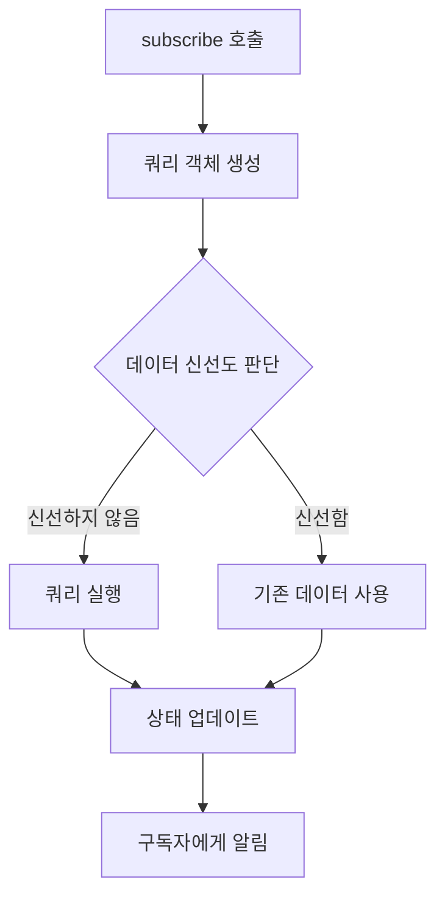

# Step 1: core 로직 구현하기

## QueryClient

`QueryClient`는 `QueryCache`를 의존하며, 데이터 패칭 및 캐시 무효화와 같은 기능을 제공합니다. 예를 들어 데이터 패칭은 `Query`에 구현되어 있습니다.

> **defaultOptions 값은 무엇인가요?**
>
> Query의 기본 옵션을 전역으로 설정하는 값 입니다.

`QueryClient` 클래스는 쿼리 관리를 위한 중추적인 로직을 담고 있는 구조입니다. 주로 상태 관리 라이브러리(React Query, SWR 등)에서 사용되는 패턴을 구현한 것으로 보입니다.

### 클래스 구조 핵심 분석

```js
class QueryClient {
  cache; // 클래스 필드 선언

  constructor(config) {
    this.cache = config.cache || new QueryCache();
    this.defaultOptions = config.defaultOptions;
  }

  // 화살표 함수 메서드
  getQueryCache = () => {
    /*...*/
  };

  defaultQueryOptions = (options) => {
    /*...*/
  };
}
```

### 주요 컴포넌트 해부

1. 캐시 관리 시스템 (cache)

   - 역할: 모든 쿼리 데이터 저장소
   - 초기화 로직
     ```javascript
     this.cache = config.cache || new QueryCache();
     ```
   - 외부에서 캐시 인스턴스 주입 가능(테스트 용이성)
   - 기본값으로 새 `QueryCache` 생성

2. 생성자 구성 (constructor)
   ```javascript
   constructor(config) {
   this.cache = config.cache || new QueryCache();
   this.defaultOptions = config.defaultOptions;
   }
   ```
   - 구성 객체 패턴: 확장성 있는 설정 관리
   - 옵션 기본값 처리: 사용자 정의 옵션 우선 적용

### 메서드 기능 설명

1. `getQueryCache()`

   ```javascript
   getQueryCache = () => {
     return this.cache;
   };
   ```

   - 캐시 인스턴스 반환: 외부 모듈과의 상호작용 용이
   - 화살표 함수 사용: this 바인딩 문제 방지

2. `defaultQueryOptions()`

   ```javascript
   defaultQueryOptions = (options) => {
     const mergedQueryOptions = {
       ...this.defaultOptions?.queries, // 옵셔널 체이닝
       ...options, // 사용자 옵션 병합
     };

     return {
       ...mergedQueryOptions,
       queryHash:
         mergedQueryOptions.queryHash || hashKey(mergedQueryOptions.queryKey),
     };
   };
   ```

   **작동 단계**:

   - 1. 옵션 병합: 기본 설정 + 사용자 설정
   - 2. 해시 생성: `hashKey` 유틸리티 활용
   - 3. 최종 객체 반환: 불변성 유지

### 설계 패턴 분석

1. 의존성 주입

- 캐시 인스턴스를 외부에서 주입 가능하도록 설계

```javascript
// 사용 예시
const customCache = new QueryCache();
new QueryClient({ cache: customCache });
```

2. 옵션 합성 전략

```javascript
{
  ...defaults,
  ...userOptions,
  queryHash: customHash || generatedHash
}
```

- 기본값 → 사용자값 순으로 병합
- 해시 생성 로직 분리

3. 불변성 유지

   - 객체 스프레드 사용으로 새 객체 생성
   - 사이드 이펙트 최소화

## QueryCache

QueryCache는 메모리에 Query를 캐싱하는 역할을 담당합니다. Map 객체 기반으로 구현되어 있으며, queryKey 값을 해싱하여 key로 활용합니다.

- **key**: Query의 queryKey 값을 기반으로 해싱된 값을 사용합니다. 해싱함수는 JSON.stringify 기반의 [hashKey](./tanstack-query-lite/core/util.js#L2) 함수를 사용합니다.
- **value**: Query

> QueryCache 어떤 메소드로 Query를 추가하나요?

build 메소드를 기반으로 Query를 추가합니다. 만약 queryKey 값에 해당하는 Query가 이미 존재한다면, 캐싱되어 있는 Query를 반환하여 불필요한 Query 객체의 인스턴스 생성을 방지합니다.

### 1. 저장소 초기화

```js
constructor() {
this.queries = new Map(); // Map<queryHash, Query>
}
```

| 항목        | 설명               | 자료구조 특징              |
| ----------- | ------------------ | -------------------------- |
| `Map`       | 쿼리 저장 컨테이너 | Key-Value 쌍 관리          |
| `queryHash` | 고유 식별자        | `hashKey(queryKey)`로 생성 |

### 2. 핵심 메서드

#### 🔍 `get()` - 쿼리 조회

```js
get = (queryHash) => {
  return this.queries.get(queryHash); // O(1) 조회
};
```

- **동작**: 해시 기반 직접 접근
- **사용 예시**: 캐시 히트 확인

#### 🛠️ `build()` - 쿼리 생성/반환

```js
build(client, options) {
  const queryKey = options.queryKey;
  const queryHash = hashKey(queryKey);

  let query = this.get(queryHash);

  if (!query) {
    query = new Query({
      cache: this,
      queryKey,
      queryHash,
      options: client.defaultQueryOptions(options)
    });

    this.queries.set(query.queryHash, query);
  }

  return query;
}

remove = (query) => {
  this.queries.delete(query.queryHash);
};
```

**작동 순서**:

1. 쿼리 키 → 해시 변환
2. 기존 캐시 확인
3. 캐시 미존재 시 새 Query 생성
4. 옵션 병합(`client.defaultQueryOptions()`)
5. 캐시 등록

#### 🗑️ `remove()` - 쿼리 삭제

```js
remove = (query) => {
  this.queries.delete(query.queryHash);
};
```

- **목적**: 명시적 캐시 무효화
- **사용 시점**: 데이터 업데이트/에러 발생 시

### 🎯 설계 패턴

#### 1. 해시 기반 캐싱

```js
const queryHash = hashKey(queryKey);
```

- **장점**: 복잡한 객체도 단순 문자열로 관리
- **전형적 사용처**: 상태 관리 라이브러리(React Query 등)

#### 2. 지연 생성(Lazy Loading)

```js
if (!query) {
  /* 새 인스턴스 생성 */
}
```

- **최적화**: 실제 사용 시점에 인스턴스 생성
- **효과**: 불필요한 메모리 사용 방지

#### 3. 옵션 병합 구조

- 사용자 옵션 → 클라이언트 기본값 → 글로벌 기본값
- **우선순위**: 구체적 설정이 일반 설정을 덮어씀

## Query

Query는 서버 상태를 관리합니다. 서버 상태 관리는 서버 상태를 저장하고, 서버 상태를 조회하는 역할을 의미합니다. 옵저버 패턴으로 구독을 허용하고 있으며, 서버 상태가 변경될 때 구독자들에게 이벤트를 발행합니다.

> 서버 상태 조회 로직은 어떻게 동작하나요?

fetch 메소드를 제공하여 서버 상태를 조회합니다. 서버 상태 조회 로직은 Query 생성 시점에 전달되는 queryFn 함수를 사용합니다. fetch 메소드가 호출될 때 마다 서버 상태 요청이 발생하지 않도록, Promise 객체를 promise 멤버 변수로 관리합니다. 요청의 상태에 promise 멤버 변수를 상태를 정리해 봅시다.

- 요청 발생: queryFn 함수 기반으로 생성된 Promise 객체를 promise 멤버 변수에 할당합니다.
- 요청 중: promise 멤버 변수의 값을 반환합니다. (Promise 객체를 새롭게 생성하지 않습니다.)
- 요청 완료: promise 멤버 변수를 null로 초기화합니다.

> staleTime은 어떻게 동작하나요?

서버 상태가 마지막으로 변경된 시점을 timestamp 기반의 lastUpdated 멤버 변수로 저장하고 있습니다. fetch 메소드가 실행되기 전 `Date.now() - lastUpdated` 값과 staleTime를 비교하여, fetch 메소드 실행 여부를 판단합니다.

```jsx
const diffUpdatedAt = Date.now() - lastUpdated;
const needsToFetch = diffUpdatedAt > staleTime;

if (needsToFetch) {
  query.fetch();
}
```

> gcTime은 어떻게 동작하나요?

Query가 생성되는 시점에 [setTimeout](https://developer.mozilla.org/ko/docs/Web/API/Window/setTimeout)를 사용하여 scheduleGcTimeout 메소드를 통해 gc를 관리합니다. gcTime timeout이 호출되면 QueryCache에게 제거를 요청합니다.

구독이 발생될 때 마다 clearGcTimeout 메소드를 사용하여 timeout이 초기화됩니다. 만약 구독이 해제될 때 구독자 리스트의 길이가 0 이라면, scheduleGcTimeout이 다시 실행됩니다.

## Query

### 📌 클래스 핵심 역할

- **쿼리 인스턴스의 상태 관리** (데이터/에러/상태 추적)
- **자동 가비지 컬렉션(GC)** 구현
- **옵저버 패턴** 기반 상태 변경 알림
- **중복 요청 방지** 기능

### 🧩 주요 프로퍼티

| 프로퍼티    | 타입       | 설명                |
| ----------- | ---------- | ------------------- |
| `cache`     | QueryCache | 부모 캐시 참조      |
| `queryKey`  | Array      | 쿼리 식별 키        |
| `queryHash` | String     | 해시값              |
| `options`   | Object     | 병합된 옵션 설정    |
| `observers` | Array      | 상태 관찰자 리스트  |
| `state`     | Object     | 현재 상태 정보      |
| `promise`   | Promise    | 진행 중인 요청 제어 |
| `gcTimeout` | TimeoutID  | GC 타이머           |

### ⚙️ 핵심 메서드 분석

#### 1. 가비지 컬렉션 관리

```js
scheduleGcTimeout = () => {
  const { gcTime } = this.options;

  this.gcTimeout = setTimeout(() => {
    this.cache.remove(this);
  }, gcTime);
};

clearGcTimeout = () => {
  clearTimeout(this.gcTimeout);
  this.gcTimeout = null;
};
```

- **GC 전략**: `gcTime` 옵션 기준 비활성 쿼리 자동 삭제
- **생명주기 제어**:
  - 구독 발생 → GC 취소
  - 구독 해제 시 관찰자 0개 → GC 재예약

#### 2. 상태 관리 시스템

```js
state = {
  data: undefined, // 실제 데이터
  error: undefined, // 에러 객체
  status: "pending", // 상태값 (pending/success/error)
  isFetching: true, // 요청 진행 여부
  lastUpdated: undefined, // 최종 업데이트 시간
};
setState = (updater) => {
  this.state = updater(this.state);
  this.observers.forEach((observer) => observer.notify());
  this.cache.notify();
};
```

- **상태 머신**: 5가지 상태 프로퍼티 관리
- **변경 전파**: 상태 변경 시 모든 관찰자에게 알림

#### 3. 구독 관리 시스템

```js
subscribe = (observer) => {
  this.observers.push(observer);
  this.clearGcTimeout(); // 구독이 발생할 때 gc 요청을 해제합니다.
  return () => {
    this.observers = this.observers.filter((d) => d !== observer);

    // 구독이 해제되는 시점에 구독 리스트의 길이가 0 이라면, QueryCache에게 gc를 다시 요청합니다.
    if (!this.observers.length) {
      this.scheduleGcTimeout();
    }
  };
};
```

- **옵저버 패턴**: 컴포넌트-쿼리 상태 동기화
- **구독 해제 로직**: 반환 함수로 관리

#### 4. 데이터 요청 핸들러

```js
fetch = () => {
  // promise 객체를 멤버 변수로 활용하여, 불필요한 요청을 방지합니다.
  if (!this.promise) {
    this.promise = (async () => {
      this.setState((old) => ({ ...old, isFetching: true, error: undefined }));

      try {
        if (!this.options.queryFn) {
          throw new Error(`Missing queryFn: '${this.options.queryHash}'`);
        }

        const data = await this.options.queryFn();

        // 성공 상태 업데이트
        this.setState((old) => ({
          ...old,
          status: "success",
          data,
          lastUpdated: Date.now(),
        }));
      } catch (error) {
        // 에러 상태 업데이트
        this.setState((old) => ({ ...old, status: "error", error }));
      } finally {
        this.setState((old) => ({ ...old, isFetching: false }));

        this.promise = null;
      }
    })();
  }

  return this.promise;
};
```

| 특징           | 설명                                 |
| -------------- | ------------------------------------ |
| 중복 요청 방지 | `promise` 플래그로 제어              |
| 상태 자동 갱신 | 요청 시작/성공/실패 시 상태 업데이트 |
| 에러 핸들링    | `try-catch-finally`로 안전한 처리    |

### 🎯 설계 패턴

#### 1. 상태 머신 패턴

> pending → (success | error)

- **장점**: 예측 가능한 상태 전이
- **트리거**: `fetch()` 호출 시 자동 전환

#### 2. 옵저버 패턴

> `observers.forEach(observer => observer.notify());`

- **실시간 동기화**: 상태 변경 즉시 모든 구독자 알림

#### 3. 가비지 컬렉션 전략

> [구독 발생] → GC 취소
>
> [구독 해제] → 관찰자 0개 → GC 예약

- **효과**: 미사용 쿼리 자동 정리

### 🔄 아키텍처 흐름도

```
[Component] → subscribe() → [Query]
↑
| notify()
↓
[Query] → state 변경 → 모든 Observers
```

## QueryObserver

QueryObserver는 Query 구독합니다. queryKey 값을 기반으로 Query를 직접적으로 의존할 수 있으며, Query의 상태가 변경될 때 마다 이벤트를 발행받아 notify 메소드를 실행시킵니다.

QueryObserver는 Query와 동일하게 옵저버 패턴을 기반으로 구독을 허용하고 있습니다. 구독이 발생할 때 Query의 fetch 메소드를 실행하여 최신 서버 상태를 조회하도록 요청합니다.

```js
const noop = () => {};

class QueryObserver {
  client;
  options;
  notify = noop;

  constructor(client, options) {
    this.client = client;
    this.options = options;
  }

  getQuery = () => {
    // options의 queryKey 값을 기반으로 구독되어 있는 Query를 조회합니다.
    const query = this.client.getQueryCache().build(this.client, this.options);

    return query;
  };

  getResult = () => {
    // Query 객체에서 관리하고 있는 서버 상태를 조회합니다.
    return this.getQuery().state;
  };

  subscribe = (callback) => {
    // Query 객체의 서버 상태가 변경될 때 호출이 필요한 callback 함수를 notify 멤버 변수로 저장합니다.
    this.notify = callback;

    const query = this.getQuery();

    const { lastUpdated } = query.state;
    const { staleTime } = this.options;

    const needsToFetch = !lastUpdated || Date.now() - lastUpdated > staleTime;

    const unsubscribeQuery = query.subscribe(this);

    if (needsToFetch) {
      query.fetch();
    }

    const unsubscribe = () => {
      unsubscribeQuery();
      this.notify = noop;
    };

    return unsubscribe;
  };
}

export default QueryObserver;
```

### 클래스 구조와 핵심 기능

#### 1. 초기화 및 의존성 주입

- `client`와 `options`를 생성자 주입 방식으로 받음
- `notify` 콜백 함수는 초기값으로 빈 함수(noop) 할당

#### 2. 쿼리 상태 관리

```js
getQuery() {
  // options의 queryKey 값을 기반으로 구독되어 있는 Query를 조회합니다.
  const query = this.client.getQueryCache().build(this.client, this.options);

    return query;
}
```

- 클라이언트의 쿼리 캐시에서 옵션 기반 쿼리 객체 생성
- 쿼리 키(queryKey)를 기반으로 캐시 관리

#### 3. 상태 조회 기능

```js
getResult = () => {
  // Query 객체에서 관리하고 있는 서버 상태를 조회합니다.
  return this.getQuery().state;
};
```

- 현재 쿼리의 상태 객체 반환 (데이터, 로딩, 에러 상태 포함)

### 구독 매커니즘

#### 4. 동적 데이터 패칭

```js
const needsToFetch = !lastUpdated || Date.now() - lastUpdated > staleTime;
```

- `staleTime` 옵션으로 유효 기간 관리
- `lastUpdated` 타임스탬프 기반 데이터 신선도 판단

#### 5. 이벤트 구독 시스템

- 콜백 함수를 구독자에게 등록 (`this.notify = callback`)

  ```js
  // Query 객체의 서버 상태가 변경될 때 호출이 필요한 callback 함수를 notify 멤버 변수로 저장합니다.
  this.notify = callback;
  ```

- 쿼리 객체의 상태 변경 시 콜백 호출
- 구독 해제 기능 제공 (`unsubscribe` 반환)

### 동작 흐름



### 주요 설계 특징

1. 캡슐화 원칙

- 내부 캐시 시스템을 클라이언트에 숨김
- 상태 관리를 쿼리 객체에 위임

2. 옵저버 패턴 적용

- Pub/Sub 모델로 효율적인 상태 변화 감지
  - Pub/Sub(발행-구독) 모델은 분산 시스템에서 비동기 통신을 구현하기 위한 메시징 패턴으로, **발행자(Publishers)**와 **구독자(Subscribers)**를 중개자(메시지 브로커)를 통해 분리하는 구조입니다. 이 모델은 실시간 데이터 스트리밍, 이벤트 기반 아키텍처, 대규모 확장성이 필요한 시스템에서 널리 활용됩니다.a
- 다중 구독자 지원 가능한 구조

3.  성능 최적화

- 불필요한 네트워크 요청 방지 (staleTime 기반)
- 메모리 누수 방지를 위한 구독 해제 메커니즘

---

# Step 2: React에서 core 로직 적용하기

React에서 core 로직을 사용하는 경우, Query의 상태가 변경될 때 컴포넌트의 다시 렌더링을 발생시켜야 합니다. 아쉽게도 core 로직은 React로 작성된 코드가 아닙니다. Query의 상태가 변경되더라도 다시 렌더링이 발생하지는 않습니다.

## Query 상태가 변경될 떄 다시 렌더링을 발생시키기

React는 외부 상태를 구독할 수 있는 `useSyncExternalStore` 커스텀 Hook을 제공하고 있습니다. 외부 상태 변경을 구독할 수 있으며, 상태 값이 변경될 때 마다 다시 렌더링이 발생됩니다.

`QueryObserver`를 `useSyncExternalStore`와 연동하면 Query의 최신 상태를 구독할 수 있고, Query 상태가 변경될 때 마다 다시 렌더링을 발생시킬 수 있습니다. 코드로 간단히 구현해보면 아래와 같습니다.

```js
const useQuery = () => {
  const [queryObserver] = useState(() => new QueryObserver());

  useSyncExternalStore(
    // subscribe
    useCallback((onStoreChange) => {
      // Query 객체를 생성하고, Query 객체의 상태가 변경될 때 onStoreChange 함수를 호출한다.
      const unsubscribe = queryObserver.subscribe(onStoreChange);

      return unsubscribe;
    }, []),
    // onStoreChange 함수가 호출될 때 Object.is로 이전 값과 최신 값을 비교하여, 다시 렌더링을 발생시킨다.
    () => queryObserver.getResult()
  );

  return queryObserver.getResult();
};
```

Query의 상태가 변경되고 다시 렌더링이 발생하는 흐름을 정리해 보면 아래와 같습니다.

1. QueryObserver를 생성합니다.
   - (1-1) Query를 생성합니다. (캐시된 Query 값이 있는 경우 생략합니다.)
   - (1-2) Query에 QueryObserver를 구독합니다. 구독할 때 notify 멤버 변수가 useSyncExternalStore의 onStoreChange로 할당됩니다.
   - (1-3) Query에게 fetch 메소드를 요청합니다. (staleTime에 따라서 fetch 메소드가 실행되지 않을 수 있습니다.)
2. Query에서 fetch 함수가 종료된 후 서버 상태를 변경합니다.
3. Query는 구독되어 있는 QueryObserver의 notify를 실행합니다.
   - (3-1) useSyncExternalStore의 onStoreChange가 실행합니다.
   - (3-2) QueryObserver는 getResult 함수를 통해 최신 상태를 반환하고 다시 렌더링을 발생시킵니다.

이제 core 로직을 React에서 활용할 수 있는 방법을 조금 더 알아보려고 합니다.

## QueryClientProvider

QueryClient는 전역으로 접근할 수 있습니다. Context를 이용하여 QueryClient를 전역으로 접근할 수 있도록 Provider와 커스텀 Hook을 작성해봅니다.

```js
export const QueryClientContext = createContext(null);

export const QueryClientProvider = ({ client, children }) => {
  return (
    <QueryClientContext.Provider value={client}>
      {children}
    </QueryClientContext.Provider>
  );
};

export const useQueryClient = (queryClient) => {
  const client = useContext(QueryClientContext);

  if (queryClient) {
    return queryClient;
  }

  if (!client) {
    throw new Error("No QueryClient set, use QueryClientProvider to set one");
  }

  return client;
};
```

최상위 컴포넌트에서 QueryClientProvider를 선언하면, 전역에서 QueryClient를 접근할 수 있습니다.

```jsx
const queryClient = new QueryClient({
  defaultOptions: {
    queries: {
      staleTime: 1_000,
      gcTime: 1_000 * 60,
    },
  },
});

// 최상위 컴포넌트
const App = ({ children }) => {
  return (
    <QueryClientProvider client={queryClient}>{children}</QueryClientProvider>
  );
};
```

### 1. Context 생성 (QueryClientContext)

```jsx
export const QueryClientContext = createContext(null);
```

- 쿼리 클라이언트 인스턴스를 저장할 React Context 생성
- 전역 상태 관리 목적: 컴포넌트 트리 전체에서 쿼리 클라이언트 접근 가능

### 2. 커스텀 훅 (useQueryClient)

```js
export const useQueryClient = (queryClient) => {
  const client = useContext(QueryClientContext);

  // 명시적 client 제공 시 우선 사용
  if (queryClient) return queryClient;

  // Context 미등록 시 에러 발생
  if (!client) throw Error("No QueryClient set...");

  return client;
};
```

**동작 로직**

- 우선순위 체크: 파라미터로 전달된 queryClient가 있으면 즉시 반환
- 컨텍스트 체크: Context에서 클라이언트 조회 시도
- 에러 핸들링: 클라이언트가 없으면 오류 발생시킴

### 3. Provider 컴포넌트 (QueryClientProvider)

```jsx
export const QueryClientProvider = ({ children, client }) => {
  useEffect(() => {
    const cache = client.getQueryCache();

    // 윈도우 포커스 이벤트 핸들러
    const onFocus = () => cache.onFocus();

    // 이벤트 리스너 등록
    window.addEventListener("visibilitychange", onFocus);
    window.addEventListener("focus", onFocus);

    // 클린업 함수
    return () => {
      window.removeEventListener("visibilitychange", onFocus);
      window.removeEventListener("focus", onFocus);
    };
  }, [client]);

  return (
    <QueryClientContext.Provider value={client}>
      {children}
    </QueryClientContext.Provider>
  );
};
```

**핵심 기능**

- 자동 리페칭 설정
  - 브라우저 탭 전환/포커스 시 `cache.onFocus()` 호출
  - 데이터 신선도(stale) 유지를 위한 자동 재요청 트리거
- 컨텍스트 프로바이더
  - `client` 인스턴스를 전체 컴포넌트 트리에 제공
  - `useQueryClient` 훅을 통해 하위 컴포넌트에서 접근 가능

**주요 설계 목적**

- 의존성 주입: 쿼리 클라이언트의 중앙 집중식 관리
- 이벤트 기반 캐시 관리: 사용자 상호작용에 따른 자동 데이터 갱신
- 에러 방지: Context 미설치 시 개발 단계에서 바로 오류 감지

## useQuery

useQuery는 QueryObserver를 이용하여 서버 상태를 관리하는 커스텀 Hook입니다.

QueryObserver 생성 및 useSyncExternalStore 처리 로직은 useBaseQuery에 작성되어 있습니다. useQuery는 단순히 useBaseQuery의 실행값을 반환합니다.

```js
import { useCallback, useState, useSyncExternalStore } from "react";
import QueryObserver from "../core/QueryObserver";
import { useQueryClient } from "./QueryClientProvider";

const useBaseQuery = (options, Observer, queryClient) => {
  const client = useQueryClient(queryClient);

  const [observer] = useState(() => {
    const defaultOptions = client.defaultQueryOptions(options);
    return new Observer(client, defaultOptions);
  });

  const subscribe = useCallback(
    (onStoreChange) => {
      // Query 객체의 상태가 변경될 때 onStoreChange 메소드가 호출됩니다.
      const unsubscribe = observer.subscribe(onStoreChange);
      return unsubscribe;
    },
    [observer]
  );

  const getSnapshot = useCallback(() => {
    // Object.is 를 기반으로 다시 렌더링 여부를 판단합니다.
    return observer.getResult();
  }, [observer]);

  // core 로직과 React를 연결합니다.
  useSyncExternalStore(subscribe, getSnapshot);

  return observer.getResult();
};

const useQuery = (options, queryClient) => {
  return useBaseQuery(options, QueryObserver, queryClient);
};

export default useQuery;
```

### 핵심 메커니즘

1. 상태 관리 아키텍처

   - `QueryObserver`를 통해 쿼리 상태(로딩, 에러, 데이터) 관찰
   - `useSyncExternalStore`로 외부 저장소와 React 상태 동기화
   - `Object.is` 비교를 통한 효율적인 리렌더링 제어

2. 주요 훅 구성

```js
const useBaseQuery = (options, Observer, queryClient) => {
  const client = useQueryClient(queryClient); // 쿼리 클라이언트 초기화
  const [observer] = useState(() => new Observer(client, options)); // 옵저버 생성
  const subscribe = useCallback((onStoreChange) => ... , [observer]); // 상태 변경 구독
  const getSnapshot = useCallback(() => observer.getResult(), [observer]); // 현재 상태 스냅샷

  useSyncExternalStore(subscribe, getSnapshot); // React와 외부 저장소 연결
  return observer.getResult();
};

```

### 동작 흐름

1. 초기화 단계

   - `QueryClient` 인스턴스 획득
   - 기본 옵션과 사용자 옵션 병합
   - QueryObserver` 인스턴스 생성

2. 상태 관찰 시스템

```js
observer.subscribe(onStoreChange); // 상태 변경 시 리렌더링 트리거
observer.getResult(); // { data, error, status } 반환
```

### 설계 특징

1. 관심사 분리

- `QueryObserver`: 데이터 페칭 및 상태 관리
- `useBaseQuery`: React 생명주기 연결
- `QueryClient`: 전역 설정 및 캐시 관리

2. 최적화 기법

- `useCallback`으로 함수 메모이제이션
- 상태 변경 시 얕은 비교(Shallow Comparison) 수행
- 옵저버 패턴을 통한 효율적인 이벤트 구독

# Step 3: 추가 기능 개발해보기

## ReactQueryDevtools

QueryCache에 캐싱 되어 있는 Query의 변화를 감지하기 위해, QueryCache에 옵저버 패턴을 적용합니다.

```js
class QueryCache {
  listeners;

  constructor() {
    // ...

    // 이벤트를 발행할 구독자들을 저장합니다.
    this.listeners = new Set();
  }

  // ...

  // 이벤트를 발행할 구독자를 추가합니다.
  subscribe = (listener) => {
    this.listeners.add(listener);

    const unsubscribe = () => {
      this.listeners.delete(listener);
    };

    return unsubscribe;
  };

  // 이벤트를 발행합니다.
  notify = () => {
    this.listeners.forEach((callback) => {
      callback();
    });
  };
}
```

Query는 서버 상태가 변경될 때 QueryCache의 notify 메소드를 호출하여, QueryCache에 구독되어 있는 구독자들에게 이벤트를 발행합니다.

```js
class Query {
  scheduleGcTimeout = () => {
    // ...
    this.gcTimeout = setTimeout(() => {
      // gc 시점에 QueryCache에게 이벤트를 발행합니다
      this.cache.notify();
    }, gcTime);
  };

  setState() {
    // ...

    // 상태 변경되면 QueryCache에게 이벤트를 발행합니다.
    this.cache.notify();
  }
}
```

ReactQueryDevtools는 QueryCache를 통해 캐싱되어 있는 Query 목록을 조회합니다. 서버 상태가 변경될 때 Query 목록의 상태를 갱신하기 위해 다시 렌더링됩니다.

```js
const ReactQueryDevtools = () => {
  const queryClient = useQueryClient();

  // rerender 함수를 호출하면 다시 렌더링이 발생합니다.
  const [, rerender] = useReducer((i) => i + 1, 0);

  useEffect(() => {
    // QueryCache에서 notify 이벤트가 발행되면 rerender 함수를 호출합니다.
    return queryClient.cache.subscribe(rerender);
  }, [queryClient]);

  const queries = queryClient.getQueryCache().getAll();
  const sortedQueries = [...queries].sort((a, b) =>
    a.queryHash > b.queryHash ? 1 : -1
  );

  return (
    <div className="fixed bottom-0 w-full overflow-scroll text-white bg-black divide-y-2 divide-gray-800 divide-solid">
      {sortedQueries.map((query) => {
        const { queryKey, queryHash, state, observers, options } = query;
        const { isFetching, status } = state;

        const { staleTime, gcTime } = options;

        return (
          <div key={queryHash} className="p-2">
            {JSON.stringify(queryKey, null, 2)},{" "}
            {JSON.stringify({ staleTime, gcTime }, null, 2)} -{" "}
            <span className="font-bold">
              {(() => {
                if (isFetching) {
                  return <span className="text-blue-500">fetching</span>;
                }

                if (!observers.length) {
                  return <span className="text-gray-500">inactive</span>;
                }

                if (status === "success") {
                  return <span className="text-green-500">success</span>;
                }

                if (status === "error") {
                  return <span className="text-red-500">error</span>;
                }

                return null;
              })()}
            </span>
          </div>
        );
      })}
    </div>
  );
};
```
